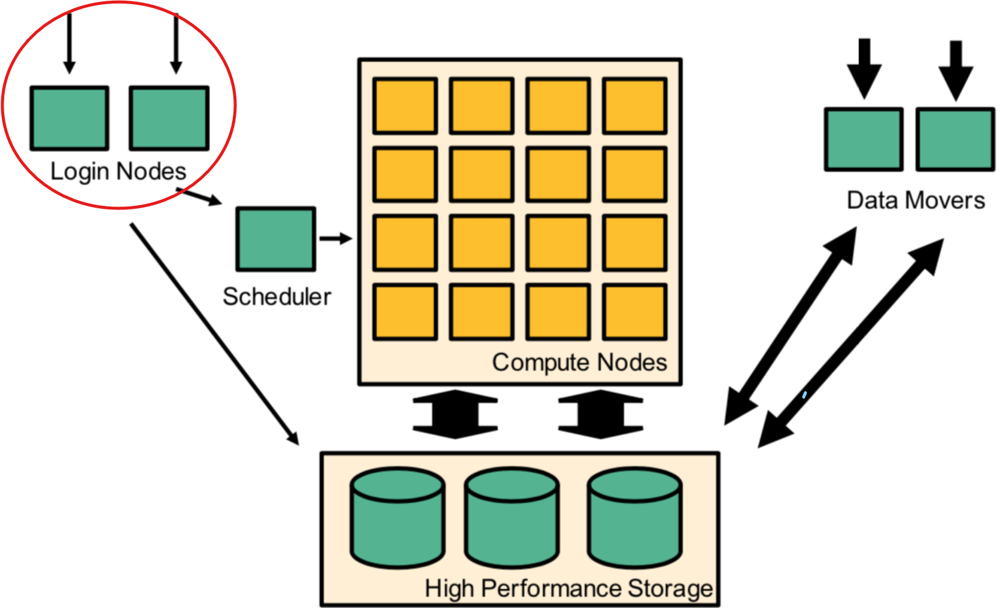
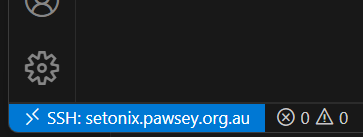
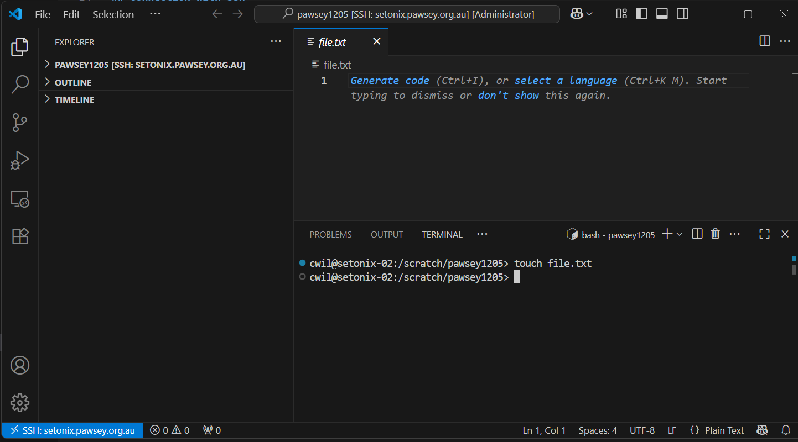

## Login nodes

When you log on to Setonix, you are *on* part of the infrastructure referred to as the *login nodes*. These are distinct from the compute nodes and data mover nodes, as depicted in this schematic from the [Pawsey user guide](https://pawsey.atlassian.net/wiki/spaces/US/pages/51925858/Connecting+to+a+Supercomputer): 




<br>

The login nodes are connected to, but not part of, the compute node environment, so remember to submit all intensive compute to the job scheduler to ensure the login nodes remain responsive for all users.

## Connection with ssh

Connection to Setonix is via `ssh`. To connect with `ssh`, you will need to use a **terminal application** or **integrated development environment** (IDE) on your local computer. 

### Connecting with X11 forwarding

If you need to use graphical interfaces on Setonix, please follow [Pawsey's instructions](https://pawsey.atlassian.net/wiki/spaces/US/pages/51925866/Running+Graphical+Applications+GUI+on+Supercomputers) on how to use `ssh` with  `X11 forwarding`. 

:::{.callout-note}
Please note that this is for **lightweight GUIs** only. For intensive visualisation tasks, for example those requiring large RAM or GPUs, please use [Pawsey's dedidcated visualisation services](https://pawsey.atlassian.net/wiki/spaces/US/pages/51923228/Visualisation+Documentation).
:::

### Connecting with a terminal application

The Setonix user guide [How to log onto Setonix](https://pawsey.atlassian.net/wiki/spaces/US/pages/51926034/How+to+log+into+Setonix) page has step by step instructions for logging on with a number of commonly used terminal clients:

- [Mac or Linux native terminal](https://pawsey.atlassian.net/wiki/spaces/US/pages/51926034/How+to+log+into+Setonix#HowtologintoSetonix-LoginwithaterminalclientonLinuxorOSX)
- [MobaXTerm on Windows](https://pawsey.atlassian.net/wiki/spaces/US/pages/51926034/How+to+log+into+Setonix#HowtologintoSetonix-LoginwithMobaXTermonWindows)
- [Putty on Windows](https://pawsey.atlassian.net/wiki/spaces/US/pages/51926034/How+to+log+into+Setonix#HowtologintoSetonix-LoginwithPuTTYonWindows)

### Connecting with VSCode IDE

[VS Code](https://code.visualstudio.com/) is a popular and user friendly interface allowing you to log on to a machine as well as providing advanced code editing extensions. 

However, there are some drawbacks to using VS Code on HPC, and these drawbacks - along with the required solutions - are detailed [here](https://pawsey.atlassian.net/wiki/spaces/US/pages/51931360/Visual+Studio+Code+for+Remote+Development). 

:::{.callout-important}
If you use VS Code to work on Setonix, **please carefully read and adhere to [this Pawsey VS Code page](
https://pawsey.atlassian.net/wiki/spaces/US/pages/51926034/How+to+log+into+Setonix#HowtologintoSetonix-LoginwithPuTTYonWindows)**
:::


**Install VS Code and connect to Setonix**

1. Download Visual Studio Code for your system from [here](https://code.visualstudio.com/download) and follow the instructions for:
    * [macOS](https://code.visualstudio.com/docs/setup/mac)
    * [Windows](https://code.visualstudio.com/docs/setup/windows)

2. Open the VS Code application on your computer 


3. Click on the extensions button (four blocks) on the left side bar and install the remote SSH extension. Click on the blue `install` button. 


Add the Setonix host details to your `.ssh` config file:

  ```default
  Host Setonix
    HostName pawsey.setonix.org.au
    User <your-pawsey-username>
  ```

  6. Type `Ctrl`+`Shift`+`P` (`Cmd`+`Shift`+`P` for Mac) and select `Remote-SSH: Connect to Host` and `Pawsey` 
  7. When prompted, select `Linux` as the platform of the remote host from the dropdown menu 
  8. Type in your Pawsey password and hit enter 

Having successfully logged in, you should see a small blue or green box in the bottom left corner of your screen:



**Set up your VSCode window**

1. Open a new folder in the file explorer panel on the left side of the screen. You can do this by typing `Ctrl` + `K`, `Ctrl` + `O` (Windows) or `Cmd`+`K`+ `Cmd` + `O` (macOS); or use the `File` menu and select `Open folder`. 
2. Enter the path `/scratch/<pawsey-project-id>` to open your `/scratch` base working directory. You can change this at any point by opening a new folder. Keep in mind you will be requested to provide your password each time, unless you have [set up `ssh` keys between your local computer and Setonix](https://pawsey.atlassian.net/wiki/spaces/US/pages/51925870/Use+of+SSH+Keys+for+Authentication). 
2. When prompted, select the box for `Trust the authors of all files in the parent folder` then click `Yes, I trust the authors`
3. To open a terminal, type `Ctrl`+`J` (Windows) or `Cmd`+`J` (macOS), or select `Terminal` from the top menu bar. The terminal will open at the bottom of the environment window. Note that you can have more than one terminal active within your VSCode environment; new terminals can be opened by selecting the `+` icon in the top right corner of the terminal. 



**Tips for using VSCode**

* Follow [these instructions](https://pawsey.atlassian.net/wiki/spaces/US/pages/51931360/Visual+Studio+Code+for+Remote+Development) to prevent VS Code hidden files from consuming your `/home` quota
* [VS Code cheatsheet for Windows](https://code.visualstudio.com/shortcuts/keyboard-shortcuts-windows.pdf)
* [VS Code cheatsheet for macOS](https://code.visualstudio.com/shortcuts/keyboard-shortcuts-macos.pdf)